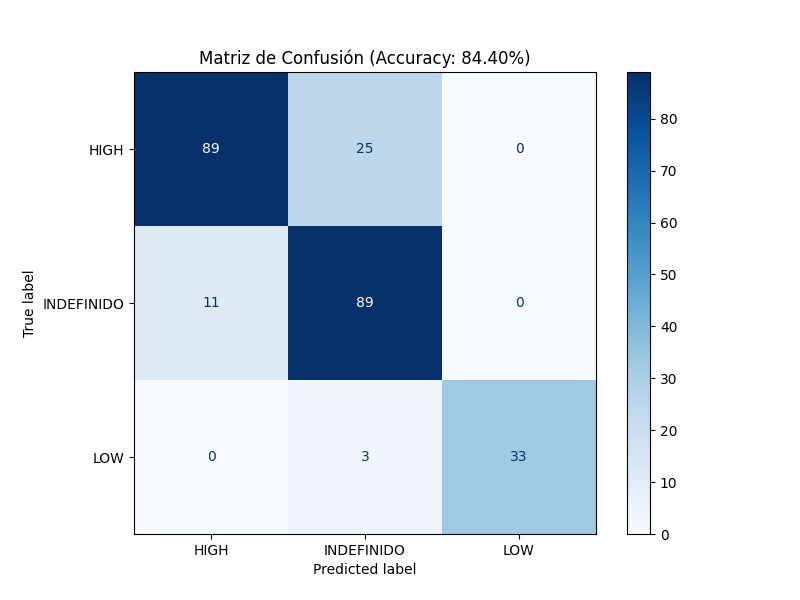

# Como ejecutar el ejemplo desde 0

### 0. Generar entorno virtual
    py venv -m venv
    
    [Windows]
    ./venv/Scripts/activate
    
    [Linux]
    ./venv/bin/activate

    pip install -r requirements.txt

### 1. Generar el dataset
    py create_data_set_logic 1000

### 2. Entrenar el modelo
    py train_logic_or.py <PATH_DATASET> <TITLE> <FUNC_ACTIVATION> (opt)<N_LAYERS>

### 3. Prueba de modelo
    cd ../scripts
    py ia_auditor.py <MODEL_PATH> <SCALER_PATH> <ENCODER_PATH> <TEST_DATASET_FILE>

# Resumen 
Este proyecto trata de la implementacion de una compuerta OR la cual recibe 2 input de tension entre 0-5V, 
se definio una banda indefinida entre 1.3V y 2V para analizar como se comportaria la IA en estos casos.

Para ello se entreno una *Red Neuronal* de 2 capas, 1 oculta y 1 de salida. Los datos de entrenamiento se lograron con el script
``create_dataset_logic_or.py`` el cual permite crear datasets basados en las especificaciones anteriores.

# Datasets

Se generó un dataset de 1000 valores los cuales se utilizaran el 20% para entrenamiento y el resto para validación, y un dataset de 250 valores para volver a validar el entramiento.

# Assets

En esta seccion se encuentran los archivos adicionales como por ejemplo la *Red Neuronal* misma, las etiquetas de los encoders para luego recuperar el valor final de prediccion y los escaladores para normalizar los datos.

# Conclusiones

<!-- Se realizo el entrenamiento de la RN con distintas configuraciones:

|  | Sigmoid | Softmax |  Softmax 8 capas |
|--------------|--------------|--------------|--------------|
| Precisión       | 84.5%      | 64.5%       | 43.75%     | -->

### 📊 REPORTE DE RENDIMIENTO DEL MODELO CON ACTIVACION SOFTMAX


**Métricas Globales:**
- **Accuracy (Exactitud):** `0.6720`
- **F1-Score (Weighted):** `0.6734`

**Detalle por Categoría:**

```
              precision    recall  f1-score   support

        HIGH       0.75      0.68      0.71       114
  INDEFINIDO       0.58      0.63      0.61       100
         LOW       0.72      0.78      0.75        36

    accuracy                           0.67       250
   macro avg       0.68      0.69      0.69       250
weighted avg       0.68      0.67      0.67       250

```
<!-- ======================================== -->


### 📊 REPORTE DE RENDIMIENTO DEL MODELO CON ACTIVACION SIGMOID

**Métricas Globales:**
- **Accuracy (Exactitud):** `0.8320`
- **F1-Score (Weighted):** `0.8302`

**Detalle por Categoría:**

```
              precision    recall  f1-score   support

        HIGH       1.00      0.66      0.79       114
  INDEFINIDO       0.70      1.00      0.83       100
         LOW       1.00      0.92      0.96        36

    accuracy                           0.83       250
   macro avg       0.90      0.86      0.86       250
weighted avg       0.88      0.83      0.83       250

```

### 📊 REPORTE DE RENDIMIENTO DEL MODELO CON ACTIVACION SIGMOID 4 CAPAS


**Métricas Globales:**
- **Accuracy (Exactitud):** `0.8440`
- **F1-Score (Weighted):** `0.8451`

**Detalle por Categoría:**

```
              precision    recall  f1-score   support

        HIGH       0.89      0.78      0.83       114
  INDEFINIDO       0.76      0.89      0.82       100
         LOW       1.00      0.92      0.96        36

    accuracy                           0.84       250
   macro avg       0.88      0.86      0.87       250
weighted avg       0.85      0.84      0.85       250

```



### 📊 REPORTE DE RENDIMIENTO DEL MODELO CON ACTIVACION SIGMOID 8 CAPAS

**Métricas Globales:**
- **Accuracy (Exactitud):** `0.4000`
- **F1-Score (Weighted):** `0.2286`

**Detalle por Categoría:**

```
              precision    recall  f1-score   support

        HIGH       0.00      0.00      0.00       114
  INDEFINIDO       0.40      1.00      0.57       100
         LOW       0.00      0.00      0.00        36

    accuracy                           0.40       250
   macro avg       0.13      0.33      0.19       250
weighted avg       0.16      0.40      0.23       250

```


